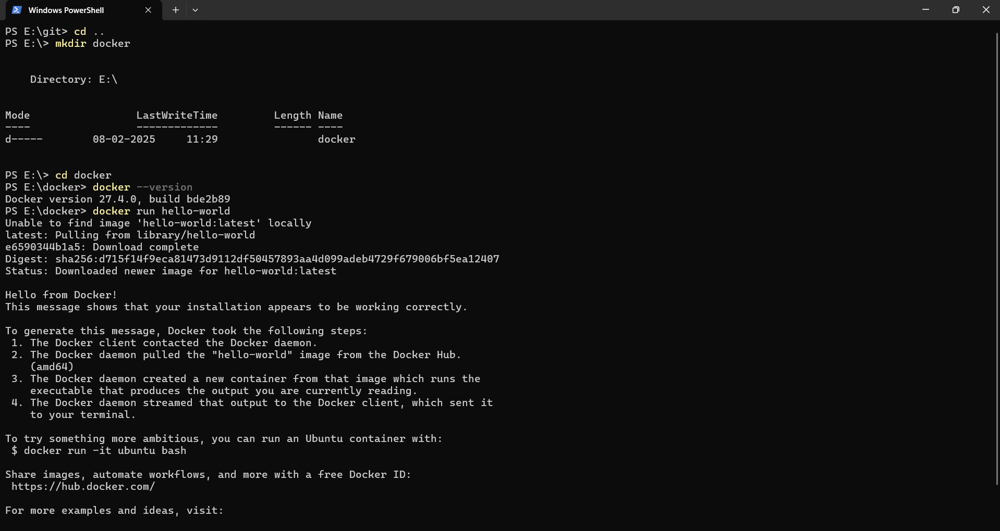
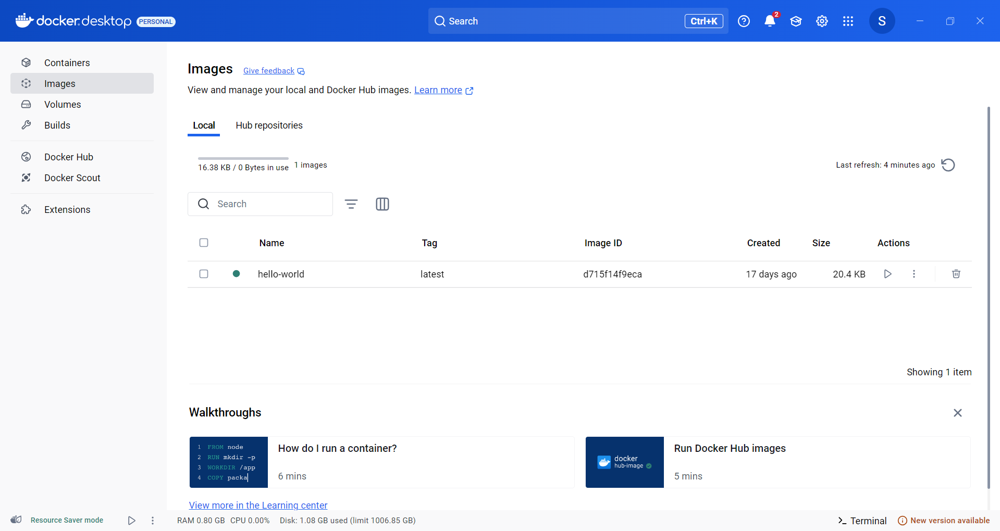
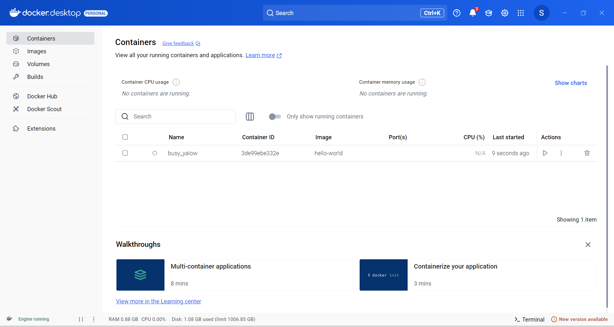

# docker-practices

## Docker Desktop for Windows

If you are running Windows 10, follow these instructions to install Docker Desktop for Windows.

Download and install Docker Desktop for Windows.

After installation is complete the screen prompting you to enable to the Hyper-V feature will be displayed. Click Yes to enable it.
Restart your computer.

Click the Docker Desktop icon.

Open the terminal of your choice, and issue the following command: 

        docker run hello-world 

If the installation was successful you will see the confirmation message.

### Image registries

An image registry stores Docker images. 

Each registry is organized into collections of images, called repositories.

